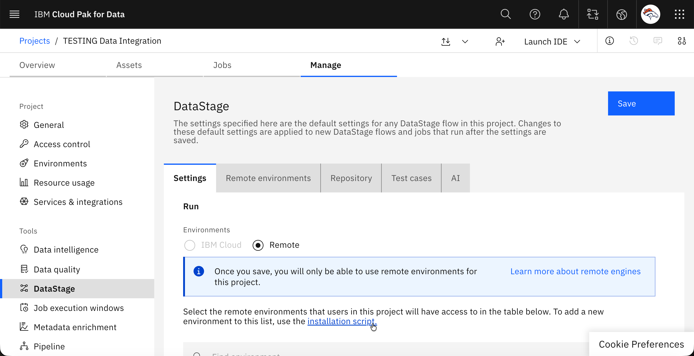
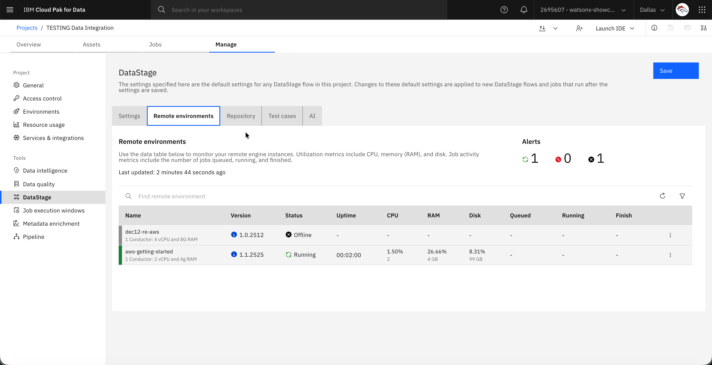

# Docker Engine Setup - Raw Commands

Just paste your terminal commands and output here as you work. I'll organize them into a tutorial later.

---

## Paste Everything Below

I am going to be using a Techzone reservation (this is for IBMers only)
Reservation Details
Operating System
RHEL-9.3.0_HVM-20240229-x86_64-27-Hourly2-GP3
Private IP
10.0.23.196
Public IP
3.23.101.44
Secondary storage device
/dev/sdh
Secondary storage size
100 GB


But this information is important b/c customers will need to ensure they have storage setup.

I just downloaded ssh key for AWS VM

```

DockerPodman ls -l
total 40
drwxr-xr-x  14 michaeldobson  staff    448 Dec  2 13:08 DataStage
-rw-r--r--@  1 michaeldobson  staff  14916 Jul 16  2025 datastage_setup.sh
-rw-r--r--@  1 michaeldobson  staff   3243 Jan 21 12:35 pem_aws_ec2_download.pem
➜  DockerPodman chmod 400 pem_aws_ec2_download.pem
➜  DockerPodman ls -l
total 40
drwxr-xr-x  14 michaeldobson  staff    448 Dec  2 13:08 DataStage
-rw-r--r--@  1 michaeldobson  staff  14916 Jul 16  2025 datastage_setup.sh
-r--------@  1 michaeldobson  staff   3243 Jan 21 12:35 pem_aws_ec2_download.pem
➜  DockerPodman ssh -i pem_aws_ec2_download.pem ec2-user@3.23.101.44
The authenticity of host '3.23.101.44 (3.23.101.44)' can't be established.
ED25519 key fingerprint is SHA256:O6x+Dbhdj0hksAc+j5bbKAkH+v8meAFeqtkgSTiRl9A.
This key is not known by any other names.
Are you sure you want to continue connecting (yes/no/[fingerprint])? yes
Warning: Permanently added '3.23.101.44' (ED25519) to the list of known hosts.
Register this system with Red Hat Insights: insights-client --register
Create an account or view all your systems at https://red.ht/insights-dashboard
[ec2-user@ip-10-0-23-196 ~]$ exit
logout
Connection to 3.23.101.44 closed.
➜  DockerPodman scp -i pem_aws_ec2_download.pem datastage_setup.sh ec2-user@3.23.101.44:~/
datastage_setup.sh                                                                      100%   15KB 524.4KB/s   00:00
➜  DockerPodman ssh -i pem_aws_ec2_download.pem ec2-user@3.23.101.44
Register this system with Red Hat Insights: insights-client --register
Create an account or view all your systems at https://red.ht/insights-dashboard
Last login: Wed Jan 21 17:36:23 2026 from 129.41.87.5
[ec2-user@ip-10-0-23-196 ~]$ cat datastage_setup.sh
#!/bin/bash

# DataStage Remote Engine Setup Script
# This script automates the setup of a DataStage Remote Engine on an AWS EC2 instance
# with thorough verification of all components including containerd configuration

# Create log file
LOG_FILE="/home/ec2-user/datastage_setup_$(date +%Y%m%d_%H%M%S).log"
touch "$LOG_FILE"

# Function to log messages
log() {
    local timestamp=$(date "+%Y-%m-%d %H:%M:%S")
    echo "[$timestamp] $1" | tee -a "$LOG_FILE"
}

# Function to log system information
log_system_info() {
    {
        echo "===================== SYSTEM INFORMATION ====================="
        echo "Date and Time: $(date)"
        echo "Hostname: $(hostname)"
        echo "Kernel: $(uname -r)"
        echo "CPU: $(grep "model name" /proc/cpuinfo | head -1 | cut -d':' -f2 | xargs)"
        echo "Memory: $(free -h | grep Mem | awk '{print $2}')"
        echo "Disk Space:"
        df -h
        echo "===================== END SYSTEM INFORMATION ================="
    } | tee -a "$LOG_FILE"
}

# Function to print section headers
print_header() {
    echo -e "\n\033[1;36m==============================================="
    echo -e "$1"
    echo -e "===============================================\033[0m\n"
    log "SECTION: $1"
}

# Function to check and log status
check_status() {
    local status=$?
    local message=$1
    if [ $status -eq 0 ]; then
        echo -e "\033[0;32m✓ Success: $message\033[0m"
        log "SUCCESS: $message"
    else
        echo -e "\033[0;31m✗ Error: $message (Exit Code: $status)\033[0m"
        log "ERROR: $message (Exit Code: $status)"
        exit 1
    fi
}

# Function to verify a condition with custom message
verify() {
    local condition=$1
    local success_msg=$2
    local error_msg=$3

    if eval "$condition"; then
        echo -e "\033[0;32m✓ $success_msg\033[0m"
        log "VERIFIED: $success_msg"
        return 0
    else
        echo -e "\033[0;31m✗ $error_msg\033[0m"
        log "VERIFICATION FAILED: $error_msg"
        return 1
    fi
}

# Start script
print_header "Starting DataStage Remote Engine Setup"
log "Script started"
log_system_info

echo "Running as: $(whoami)"
echo "Current directory: $(pwd)"
log "Running script as $(whoami) from $(pwd)"
log "Log file: $LOG_FILE"

# Install Required Software
print_header "Step 1: Installing Required Software"

log "Updating package lists..."
echo "Updating package lists..."
sudo dnf -y update
check_status "Package list update"

log "Installing Git and jq..."
echo "Installing Git and jq..."
sudo dnf -y install jq git
check_status "Git and jq installation"

# Verify installation
echo "Verifying Git version..."
git_version=$(git --version)
echo "$git_version"
if ! verify "[[ \"$git_version\" == *\"git version\"* ]]" \
    "Git is properly installed: $git_version" \
    "Git installation failed or version couldn't be determined"; then
    exit 1
fi

echo "Verifying jq version..."
jq_version=$(jq --version)
echo "$jq_version"
if ! verify "[[ \"$jq_version\" == *\"jq\"* ]]" \
    "jq is properly installed: $jq_version" \
    "jq installation failed or version couldn't be determined"; then
    exit 1
fi

# Log software versions
log "Installed software versions:"
log "Git: $git_version"
log "jq: $jq_version"

# Verify Secondary Disk
print_header "Step 2: Verifying Secondary Disk"

echo "Checking for secondary disk..."
lsblk | tee -a "$LOG_FILE"
if ! verify "lsblk | grep -q \"xvdh\"" \
    "Secondary disk (xvdh) found" \
    "Secondary disk (xvdh) not found. This is required for installation."; then
    exit 1
fi

# Disk details
disk_details=$(sudo fdisk -l /dev/xvdh 2>/dev/null || echo "No disk details available")
log "Secondary disk details:"
log "$disk_details"

# Install Docker
print_header "Step 3: Installing Docker"

echo "Removing any existing Docker installations..."
log "Removing any existing Docker installations..."
sudo dnf remove -y docker docker-client docker-client-latest docker-common docker-latest docker-latest-logrotate docker-logrotate docker-engine podman runc || true
check_status "Removal of existing Docker installations"

echo "Installing Docker CE..."
log "Installing Docker CE..."
sudo dnf -y install dnf-plugins-core
check_status "DNF plugins core installation"

log "Adding Docker repository..."
sudo dnf -y config-manager --add-repo https://download.docker.com/linux/rhel/docker-ce.repo
check_status "Adding Docker repository"

log "Installing Docker packages..."
sudo dnf -y install docker-ce docker-ce-cli containerd.io docker-buildx-plugin docker-compose-plugin
check_status "Docker installation"

log "Adding current user to docker group..."
echo "Adding current user to docker group..."
sudo usermod -aG docker ec2-user
check_status "Adding user to docker group"

echo "Verifying Podman is not installed..."
if command -v podman &> /dev/null; then
    echo -e "\033[0;31m✗ Podman is still installed. This may cause conflicts.\033[0m"
    log "WARNING: Podman is still installed. Attempting to remove..."
    echo -e "Attempting to remove Podman..."
    sudo dnf remove -y podman
    if command -v podman &> /dev/null; then
        echo -e "\033[0;31m✗ Failed to remove Podman\033[0m"
        log "ERROR: Failed to remove Podman"
        exit 1
    else
        echo -e "\033[0;32m✓ Podman has been removed\033[0m"
        log "SUCCESS: Podman has been removed"
    fi
else
    echo -e "\033[0;32m✓ Podman is not installed\033[0m"
    log "VERIFIED: Podman is not installed"
fi

# Set Up Secondary Disk
print_header "Step 4: Setting Up Secondary Disk"

# Check if the disk is already formatted and mounted
if mount | grep -q "/dev/xvdh on /mnt/data"; then
    echo -e "\033[0;32m✓ Secondary disk is already mounted to /mnt/data\033[0m"
    log "VERIFIED: Secondary disk is already mounted to /mnt/data"
else
    # Disk is not mounted, proceed with formatting and mounting
    echo "Formatting the disk with XFS filesystem..."
    log "Formatting disk /dev/xvdh with XFS filesystem..."
    sudo mkfs.xfs -f /dev/xvdh | tee -a "$LOG_FILE"
    check_status "XFS formatting"

    echo "Creating mount point directory..."
    log "Creating mount point directory at /mnt/data..."
    sudo mkdir -p /mnt/data
    check_status "Creating mount point"

    echo "Mounting the disk..."
    log "Mounting /dev/xvdh to /mnt/data..."
    sudo mount /dev/xvdh /mnt/data
    check_status "Mounting disk"
fi

echo "Setting ownership..."
log "Setting /mnt/data ownership to ec2-user..."
sudo chown ec2-user:ec2-user /mnt/data
check_status "Setting ownership"

echo "Making the mount persistent across reboots..."
log "Checking for existing fstab entry..."
if grep -q "/dev/xvdh /mnt/data" /etc/fstab; then
    echo -e "\033[0;32m✓ fstab entry for /dev/xvdh already exists\033[0m"
    log "VERIFIED: fstab entry for /dev/xvdh already exists"
else
    log "Adding /dev/xvdh to /etc/fstab..."
    echo "/dev/xvdh /mnt/data xfs defaults 0 0" | sudo tee -a /etc/fstab
    check_status "Updating fstab"
fi

# Verify the mount is working
echo "Verifying the disk is mounted correctly..."
df_output=$(df -h /mnt/data)
echo "$df_output"
log "Mount point usage: $df_output"

if ! verify "df -h | grep -q \"/mnt/data\"" \
    "Disk is mounted correctly" \
    "Disk mount verification failed"; then
    exit 1
fi

# Get disk space info
disk_space=$(df -h /mnt/data | grep "/mnt/data")
disk_size=$(echo "$disk_space" | awk '{print $2}')
disk_used=$(echo "$disk_space" | awk '{print $3}')
disk_avail=$(echo "$disk_space" | awk '{print $4}')
log "Disk /mnt/data - Size: $disk_size, Used: $disk_used, Available: $disk_avail"

echo "Final mount verification..."
lsblk | tee -a "$LOG_FILE"
if ! verify "lsblk | grep -q \"xvdh.*mnt/data\"" \
    "Secondary disk is properly mounted to /mnt/data" \
    "Secondary disk mount verification failed"; then
    exit 1
fi

# Configure Docker AND Containerd to Use Secondary Disk
print_header "Step 5: Configuring Docker AND Containerd to Use Secondary Disk"

echo "Stopping Docker and containerd services..."
log "Stopping Docker and containerd services..."
sudo systemctl stop docker
sudo systemctl stop containerd
check_status "Stopping services"

echo "Creating directories on the secondary disk..."
log "Creating directories on secondary disk..."
sudo mkdir -p /mnt/data/docker
sudo mkdir -p /mnt/data/containerd
check_status "Creating directories"

echo "Removing old data from /var/lib if it exists..."
log "Removing old Docker and containerd data from /var/lib..."
sudo rm -rf /var/lib/docker
sudo rm -rf /var/lib/containerd
log "Removed old data from /var/lib"

echo "Creating Docker configuration directory..."
log "Creating Docker configuration directory at /etc/docker..."
sudo mkdir -p /etc/docker
check_status "Creating Docker config directory"

echo "Configuring Docker daemon.json..."
log "Setting Docker data-root to /mnt/data/docker in daemon.json..."
cat << 'EOF' | sudo tee /etc/docker/daemon.json
{
  "data-root": "/mnt/data/docker",
  "storage-driver": "overlay2"
}
EOF
check_status "Creating Docker daemon.json"

# Verify daemon.json
if ! verify "grep -q \"/mnt/data/docker\" /etc/docker/daemon.json" \
    "Docker configuration file has correct data-root path" \
    "Docker configuration file does not contain the expected data-root path"; then
    exit 1
fi
log "Docker daemon.json created with data-root=/mnt/data/docker"

echo "Creating containerd configuration directory..."
log "Creating containerd configuration directory..."
sudo mkdir -p /etc/containerd
check_status "Creating containerd config directory"

echo "Generating containerd configuration with custom root path..."
log "Generating containerd configuration with custom root..."

# Generate config and use Python to properly modify it
sudo containerd config default > /tmp/containerd_config.toml

python3 << 'PYTHON_EOF'
with open('/tmp/containerd_config.toml', 'r') as f:
    lines = f.readlines()

with open('/tmp/containerd_config_fixed.toml', 'w') as f:
    for line in lines:
        # Replace any line that sets root to /var/lib/containerd
        if 'root =' in line and 'containerd' in line:
            # Preserve indentation
            indent = len(line) - len(line.lstrip())
            f.write(' ' * indent + 'root = "/mnt/data/containerd"\n')
        else:
            f.write(line)
PYTHON_EOF

sudo mv /tmp/containerd_config_fixed.toml /etc/containerd/config.toml
sudo rm -f /tmp/containerd_config.toml
check_status "Creating containerd config"

# Verify containerd config
containerd_root=$(grep "^root = " /etc/containerd/config.toml | head -1)
echo "Containerd root configuration: $containerd_root"
log "Containerd root configuration: $containerd_root"

if ! verify "[[ \"$containerd_root\" == *'/mnt/data/containerd'* ]]" \
    "Containerd configuration has correct root path" \
    "Containerd configuration does not contain the expected root path"; then
    log "ERROR: containerd config verification failed. Got: $containerd_root"
    log "Manual intervention required. Please edit /etc/containerd/config.toml"
    echo -e "\033[0;31m✗ Containerd configuration failed. Manual edit required.\033[0m"
    echo "Please run: sudo vi /etc/containerd/config.toml"
    echo "Find the line with 'root =' and change it to: root = \"/mnt/data/containerd\""
    exit 1
fi

echo "Setting permissions on directories..."
log "Setting ownership and permissions..."
sudo chown -R root:root /mnt/data/docker
sudo chown -R root:root /mnt/data/containerd
sudo chmod -R 755 /mnt/data/docker
sudo chmod -R 755 /mnt/data/containerd
check_status "Setting permissions"

echo "Reloading systemd daemon..."
log "Reloading systemd daemon..."
sudo systemctl daemon-reload
check_status "Reloading systemd"

echo "Starting containerd..."
log "Starting containerd service..."
sudo systemctl start containerd
check_status "Starting containerd"

# Wait for containerd to fully start
sleep 3

echo "Starting Docker..."
log "Starting Docker service..."
sudo systemctl start docker
check_status "Starting Docker"

# Wait for Docker to fully start
sleep 3

echo "Enabling services to start on boot..."
log "Enabling services to start on boot..."
sudo systemctl enable docker
sudo systemctl enable containerd
check_status "Enabling services"

echo "Verifying Docker service status..."
docker_status=$(sudo systemctl is-active docker)
if ! verify "[[ \"$docker_status\" == \"active\" ]]" \
    "Docker service is running" \
    "Docker service is not running properly"; then
    log "Docker service status: $docker_status"
    sudo systemctl status docker --no-pager | tee -a "$LOG_FILE"
    exit 1
fi
log "Docker service status: $docker_status"

echo "Verifying containerd service status..."
containerd_status=$(sudo systemctl is-active containerd)
if ! verify "[[ \"$containerd_status\" == \"active\" ]]" \
    "containerd service is running" \
    "containerd service is not running properly"; then
    log "containerd service status: $containerd_status"
    sudo systemctl status containerd --no-pager | tee -a "$LOG_FILE"
    exit 1
fi
log "containerd service status: $containerd_status"

echo "Verifying Docker is using the secondary disk..."
docker_root=$(sudo docker info | grep "Docker Root Dir" | sed 's/^ *//')
echo "$docker_root"
log "Docker Root Directory: $docker_root"

if ! verify "[[ \"$docker_root\" == *\"/mnt/data/docker\"* ]]" \
    "Docker is properly configured to use the secondary disk" \
    "Docker secondary disk configuration verification failed"; then
    log "ERROR: Docker is not using the secondary disk. Current Docker root: $docker_root"
    exit 1
fi

echo "Testing with a small Docker image pull..."
log "Testing Docker functionality with hello-world image..."
sudo docker pull hello-world
check_status "Docker test image pull"

echo "Verifying containerd is using secondary disk..."
sleep 2
containerd_usage=$(sudo du -sh /mnt/data/containerd 2>/dev/null | awk '{print $1}')
docker_usage=$(sudo du -sh /mnt/data/docker 2>/dev/null | awk '{print $1}')
echo "Containerd data size: $containerd_usage"
echo "Docker data size: $docker_usage"
log "Containerd data size: $containerd_usage"
log "Docker data size: $docker_usage"

if ! verify "[[ -n \"$containerd_usage\" ]]" \
    "Containerd is writing data to /mnt/data/containerd" \
    "Containerd may not be using the secondary disk"; then
    log "WARNING: Could not verify containerd data on secondary disk"
fi

# Verify /var/lib is clean
echo "Verifying /var/lib is clean..."
if [ -d /var/lib/containerd ]; then
    echo -e "\033[0;31m✗ /var/lib/containerd still exists\033[0m"
    log "WARNING: /var/lib/containerd still exists"
else
    echo -e "\033[0;32m✓ /var/lib/containerd has been removed\033[0m"
    log "VERIFIED: /var/lib/containerd has been removed"
fi

if [ -d /var/lib/docker ]; then
    echo -e "\033[0;31m✗ /var/lib/docker still exists\033[0m"
    log "WARNING: /var/lib/docker still exists"
else
    echo -e "\033[0;32m✓ /var/lib/docker has been removed\033[0m"
    log "VERIFIED: /var/lib/docker has been removed"
fi

# Clone Repository and Prepare for Remote Engine Setup
print_header "Step 6: Cloning Repository and Preparing for Remote Engine Setup"

# Change to home directory first to ensure we clone in a good location
cd $HOME
check_status "Changing to home directory"
log "Changed directory to: $HOME"

echo "Cloning the DataStage repository..."
log "Checking if DataStage repository already exists..."
if [ -d "$HOME/DataStage" ]; then
    echo -e "\033[0;32m✓ DataStage repository already exists\033[0m"
    log "VERIFIED: DataStage repository already exists at $HOME/DataStage"
    echo "Updating repository..."
    cd DataStage
    git pull | tee -a "$LOG_FILE"
    cd $HOME
else
    log "Cloning DataStage repository from GitHub..."
    git clone https://github.com/IBM/DataStage.git | tee -a "$LOG_FILE"
    check_status "Cloning DataStage repository"
fi

echo "Navigating to the Remote Engine directory..."
log "Changing directory to DataStage/RemoteEngine/docker/..."
cd DataStage/RemoteEngine/docker/
check_status "Changing to Remote Engine directory"
log "Current directory: $(pwd)"

echo "Verifying directory contents..."
ls -l | tee -a "$LOG_FILE"
if ! verify "[ -f dsengine.sh ] && [ -f README.md ]" \
    "Repository contents verified" \
    "Repository contents verification failed"; then
    log "ERROR: Required files (dsengine.sh and/or README.md) are missing"
    exit 1
fi

# Log file permissions
dsengine_perms=$(ls -l dsengine.sh)
log "dsengine.sh permissions: $dsengine_perms"

# Check if dsengine.sh is executable
if ! verify "[ -x dsengine.sh ]" \
    "dsengine.sh is executable" \
    "dsengine.sh is not executable"; then
    log "Making dsengine.sh executable..."
    chmod +x dsengine.sh
    check_status "Making dsengine.sh executable"
fi

# Create a system state summary
print_header "System State Summary"
{
    echo "===================== SYSTEM STATE SUMMARY ====================="
    echo "Date and Time: $(date)"
    echo "Hostname: $(hostname)"

    # Docker Status
    echo "Docker Status: $(sudo systemctl is-active docker)"
    echo "Docker Version: $(sudo docker version --format '{{.Server.Version}}' 2>/dev/null || echo "Unknown")"
    echo "Docker Root: $(sudo docker info | grep "Docker Root Dir" | sed 's/^ *//')"

    # Containerd Status
    echo "Containerd Status: $(sudo systemctl is-active containerd)"
    containerd_root_check=$(grep "^root = " /etc/containerd/config.toml | head -1)
    echo "Containerd Root Config: $containerd_root_check"

    # Disk Status
    echo "Secondary Disk: /dev/xvdh"
    echo "Mount Point: /mnt/data"
    df -h /mnt/data
    echo ""
    echo "Docker data usage: $(sudo du -sh /mnt/data/docker 2>/dev/null || echo "0")"
    echo "Containerd data usage: $(sudo du -sh /mnt/data/containerd 2>/dev/null || echo "0")"
    echo ""
    echo "Root volume usage:"
    df -h /

    # User Groups
    echo "User Groups for $(whoami): $(groups)"

    # DataStage Repository
    echo "DataStage Repository Location: $HOME/DataStage"
    echo "DataStage Engine Script: $HOME/DataStage/RemoteEngine/docker/dsengine.sh"

    echo "===================== END SYSTEM STATE SUMMARY ================="
} | tee -a "$LOG_FILE"

# Final success message
print_header "Setup Complete!"
echo -e "\033[0;32mDataStage Remote Engine environment setup has completed successfully.\033[0m"
log "DataStage Remote Engine environment setup has completed successfully."

echo -e "Current directory: $(pwd)"
echo -e "Log file: $LOG_FILE"
echo -e "\n\033[1;33mKEY CONFIGURATION:\033[0m"
echo -e "  - Docker root: /mnt/data/docker"
echo -e "  - Containerd root: /mnt/data/containerd"
echo -e "  - All container images will be stored on the 100GB secondary disk"
echo -e "\nYou can now proceed with the Remote Engine installation using the dsengine.sh script."
echo -e "For more information, refer to the README.md file in this directory."
echo -e "\n\033[1;33mIMPORTANT: You need to log out and log back in for the docker group changes to take effect.\033[0m"
echo -e "After logging back in, you can run docker commands without sudo.\n"

log "Script execution completed successfully."
echo -e "\033[0;32mA detailed log of this setup has been saved to: $LOG_FILE\033[0m"
.....


```

The above datastage_setup.sh does not need to be run by customers, and I don't want to include it in a getting started doc. I am including it for you to see what needs to be done to allow Docker to install and run a remote engine. 

Once this is done, I exit from ssh and re-enter to ensure Docker changes are applied.

Then, I continue with the setup:

I open up my project in IBM Cloud, and navigate to the manage tab.

I click on DataStage on the left side, and select remote radio button. 

Click on the installation script blue highlighted test:


Select Container as my option, and fill out configuration details:
Configure details
All fields are required

Required


Optional start flags

Remote environment name
Name the remote instance
Cloud API key
Your IBM Cloud API key
Encryption key
Your encryption key
Encryption IV
Your encryption IV
IBM Cloud container registry API key
Your IBM Cloud container registry API key


Optional start flags

Maximum memory (in gigabytes)
4


Set user
Maximum CPUs
2


Mount directory
</path/to/local_dir:/path/on/container>
Volume Directory
/tmp/docker/volumes
Proxy URL
http://<username>:<password>@<proxy_ip>:<port>
Environment home
IBM Cloud Dallas (us-south)

Remote Engine Version

Use latest version


Here's what I do:
Configure Optional Flags
1.	Navigate to the Optional start flags tab next to Required
2.	Set these optional flags for your EC2 instance:
o	Max memory:  Default
o	Max CPUs: Default
o	Set user: ec2-user
o	Volume Directory: /mnt/data/
o	 
Generate and Run the Script
1.	After confirming your settings, click the blue "Generate script" button.
2.	Scroll down to see the completed script.
3.	Copy the content of the first section, starting with ./dsengine and ending with --set-user "ec2-user".
Note: Do NOT include any text above, or the final \.
o	 
4.	Paste the copied text into your terminal and run it. The installation will take a few minutes to complete.


Actual example:
name: aws-getting-started
api keys: entered
encryption key: entered
encryption IV: entered

For these^ i run the following command

```
 openssl enc -aes-256-cbc -k secret -P -md sha1
*** WARNING : deprecated key derivation used.
Using -iter or -pbkdf2 would be better.
salt=SALT
key=KEY
iv =IV
[ec2-user@ip-10-0-23-196 ~]$

```

I then fill out the form and get the following:

```
./dsengine.sh start -n "aws-getting-started" \
                    -a "qSOipvfdwXJjHSWxIgVd7u0d2V2WHsOR9A_V1SntP762" \
                    -e "114FD1E2163B412DEF208113F2A66739E148D120E2D8CD26503421946FB9CACF" \
                    -i "33DE46A74DCB8B4A405698B14F7837B9" \
                    -p "rmoZA3EHTFjoAbWbQoRWSq2eVC1NS9k8PQ7gJ-uNNXKV" \
                    --project-id "5343d6a6-bd2b-401c-abc3-9fd7747335d3" \
                    --volume-dir "/mnt/data/" \
                    --set-user "ec2-user"

```


I go back to my VM, run the startup command, and wait about 5 mins:

```

[ec2-user@ip-10-0-23-196 docker]$ ./dsengine.sh start -n "aws-getting-started" \
                    -a "qSOipvfdwXJjHSWxIgVd7u0d2V2WHsOR9A_V1SntP762" \
                    -e "114FD1E2163B412DEF208113F2A66739E148D120E2D8CD26503421946FB9CACF" \
                    -i "33DE46A74DCB8B4A405698B14F7837B9" \
                    -p "rmoZA3EHTFjoAbWbQoRWSq2eVC1NS9k8PQ7gJ-uNNXKV" \
                    --project-id "5343d6a6-bd2b-401c-abc3-9fd7747335d3" \
                    --volume-dir "/mnt/data/" \
                    --set-user "ec2-user"

IBM DataStage Remote Engine 1.0.32

DATASTAGE_HOME=https://dataplatform.cloud.ibm.com
GATEWAY_URL=https://api.dataplatform.cloud.ibm.com
PROJECT_IDS=5343d6a6-bd2b-401c-abc3-9fd7747335d3
REMOTE_ENGINE_PREFIX=aws-getting-started
DOCKER_REGISTRY=icr.io/datastage
CONTAINER_MEMORY=4g
CONTAINER_CPUS=2
PIDS_LIMIT=-1
DOCKER_VOLUMES_DIR=/mnt/data/

chmod: changing permissions of '/mnt/data/docker': Operation not permitted
chmod: cannot read directory '/mnt/data/docker': Permission denied
chmod: changing permissions of '/mnt/data/containerd': Operation not permitted
chmod: cannot read directory '/mnt/data/containerd': Permission denied
chown: cannot read directory '/mnt/data/docker': Permission denied
chown: cannot read directory '/mnt/data/containerd': Permission denied
Creating init scripts ...
Getting IAM token

Checking docker images ...
Getting IAM token to access Container Registry
Getting PX Version from Cloud Container Registry
Retrieved ds-px-runtime digest = sha256:b668e04c60d2c2efb5de20d30c20450127f631217d3863e2ea2575139ff322f1
Checking image icr.io/datastage/ds-px-runtime@sha256:b668e04c60d2c2efb5de20d30c20450127f631217d3863e2ea2575139ff322f1

Docker login to DataStage Container Registry.
WARNING! Using --password via the CLI is insecure. Use --password-stdin.
Login Succeeded
Image icr.io/datastage/ds-px-runtime@sha256:b668e04c60d2c2efb5de20d30c20450127f631217d3863e2ea2575139ff322f1 does not exist locally, proceeding to download
docker pull icr.io/datastage/ds-px-runtime@sha256:b668e04c60d2c2efb5de20d30c20450127f631217d3863e2ea2575139ff322f1
icr.io/datastage/ds-px-runtime@sha256:b668e04c60d2c2efb5de20d30c20450127f631217d3863e2ea2575139ff322f1: Pulling from datastage/ds-px-runtime
ee5a63b51a34: Pulling fs layer
988e6657ae30: Pulling fs layer
df5711c3980d: Pulling fs layer
eff06a03112d: Pulling fs layer
6330e48b6b98: Pulling fs layer
700c4ebf8add: Pulling fs layer
80106b5e8c36: Pulling fs layer
781eddad471c: Pulling fs layer
4c75f4c3ff43: Pulling fs layer
3f1a60650be0: Pulling fs layer
c63dea1a66f5: Pulling fs layer
964761502a57: Pulling fs layer
6e1584a322b0: Pulling fs layer
07f3a52dd259: Pulling fs layer
4f4fb700ef54: Pulling fs layer
2daac7a8d251: Pulling fs layer
7205e4045781: Pulling fs layer
e8738e472851: Pulling fs layer
a69325117f27: Pull complete
a5e43f9e5103: Pull complete
66e5df44a1c1: Pull complete
a4868b0df591: Pull complete
a82e41c4f6d7: Pull complete
991225399301: Pull complete
57bae42dbad7: Pull complete
74196429657e: Pull complete
bd575cb47ece: Pull complete
53261d8ee914: Pull complete
3f27372029f0: Pull complete
50f779deeeb1: Pull complete
a08192d3d261: Pull complete
58f321d1c664: Pull complete
8d9f2fd28a45: Pull complete
561c26b16dd6: Pull complete
0fd87b77de1b: Pull complete
bb0f4da6f93a: Pull complete
48991acef4af: Pull complete
d4d3bc621030: Pull complete
775ca6a661c8: Pull complete
b643616087d1: Pull complete
2e934d699bd1: Pull complete
4cab0b3ac24f: Pull complete
caa2347f42a3: Pull complete
4a6942bdf97a: Pull complete
Digest: sha256:b668e04c60d2c2efb5de20d30c20450127f631217d3863e2ea2575139ff322f1
Status: Downloaded newer image for icr.io/datastage/ds-px-runtime@sha256:b668e04c60d2c2efb5de20d30c20450127f631217d3863e2ea2575139ff322f1
icr.io/datastage/ds-px-runtime@sha256:b668e04c60d2c2efb5de20d30c20450127f631217d3863e2ea2575139ff322f1

Initializing DataStage Remote Engine Runtime environment with name 'aws-getting-started' ...
Setting up docker environment

Starting instance 'aws-getting-started' ...
Running container 'aws-getting-started_runtime' ...
Using user 1000 to run the container
chmod: changing permissions of '/mnt/data/docker': Operation not permitted
chmod: cannot read directory '/mnt/data/docker': Permission denied
chmod: changing permissions of '/mnt/data/containerd': Operation not permitted
chmod: cannot read directory '/mnt/data/containerd': Permission denied
chown: cannot read directory '/mnt/data/docker': Permission denied
chown: cannot read directory '/mnt/data/containerd': Permission denied
975b01b5bf61e6c9fd7797d476c06c6849684359ad359c201add4a67adf5b190
chmod: changing permissions of '/mnt/data/docker': Operation not permitted
chmod: cannot read directory '/mnt/data/docker': Permission denied
chmod: changing permissions of '/mnt/data/containerd': Operation not permitted
chmod: cannot read directory '/mnt/data/containerd': Permission denied
chown: cannot read directory '/mnt/data/docker': Permission denied
chown: cannot read directory '/mnt/data/containerd': Permission denied
  waiting for aws-getting-started_runtime to start... time elapsed: 0 seconds
  waiting for aws-getting-started_runtime to start... time elapsed: 5 seconds
  waiting for aws-getting-started_runtime to start... time elapsed: 10 seconds
  waiting for aws-getting-started_runtime to start... time elapsed: 15 seconds
  waiting for aws-getting-started_runtime to start... time elapsed: 20 seconds
  waiting for aws-getting-started_runtime to start... time elapsed: 25 seconds
  waiting for aws-getting-started_runtime to start... time elapsed: 30 seconds
  waiting for aws-getting-started_runtime to start... time elapsed: 35 seconds
  waiting for aws-getting-started_runtime to start... time elapsed: 40 seconds
  waiting for aws-getting-started_runtime to start... time elapsed: 45 seconds
  waiting for aws-getting-started_runtime to start... time elapsed: 50 seconds
  waiting for aws-getting-started_runtime to start... time elapsed: 55 seconds
  waiting for aws-getting-started_runtime to start... time elapsed: 60 seconds
  waiting for aws-getting-started_runtime to start... time elapsed: 65 seconds
  waiting for aws-getting-started_runtime to start... time elapsed: 70 seconds
  waiting for aws-getting-started_runtime to start... time elapsed: 75 seconds
  waiting for aws-getting-started_runtime to start... time elapsed: 80 seconds
  waiting for aws-getting-started_runtime to start... time elapsed: 85 seconds
  waiting for aws-getting-started_runtime to start... time elapsed: 90 seconds
  waiting for aws-getting-started_runtime to start... time elapsed: 95 seconds
  waiting for aws-getting-started_runtime to start... time elapsed: 100 seconds
{"service_name":"ds-px-runtime","status":"ok","timestamp":"2026-01-21T18:05:05.641Z","version":"1.1.2525","px_version":"develop-11.7.1-2025.12.19.05.32.48","connector_version":"cpd-cpd-5.0-194-"}
Started container aws-getting-started_runtime in 100 seconds

Finalizing Remote Engine instance 'aws-getting-started'...
Confirming Remote Engine registration ...
Got remote engine 'aws-getting-started' registration with id: 4a275866-8be1-42ab-b7bf-c0cd48e17105

Setting up Runtime environment using Remote Engine 'aws-getting-started' ...
Checking if runtime environment with REMOTE_ENGINE=4a275866-8be1-42ab-b7bf-c0cd48e17105 is available ...

Getting Project Environment Engine ID for project 5343d6a6-bd2b-401c-abc3-9fd7747335d3...
Could not find an existing environment with REMOTE_ENGINE=4a275866-8be1-42ab-b7bf-c0cd48e17105 for project 5343d6a6-bd2b-401c-abc3-9fd7747335d3, creating a new one ...
Created environment runtime with id: c51c0048-4b67-4cde-8160-69de96942897
Runtime Environment 'Remote Engine aws-getting-started' is registered for project 5343d6a6-bd2b-401c-abc3-9fd7747335d3.

Setup complete

Project settings:
* https://dataplatform.cloud.ibm.com/projects/5343d6a6-bd2b-401c-abc3-9fd7747335d3/manage/tool-configurations/datastage_admin_settings_section?context=cpdaas

Project assets:
* https://dataplatform.cloud.ibm.com/projects/5343d6a6-bd2b-401c-abc3-9fd7747335d3/assets?context=cpdaas

Remote engine is setup. You can navigate to the project settings and select this engine to be used by the project.

Remote Engine setup completed.
[ec2-user@ip-10-0-23-196 docker]$ docker ps -a
CONTAINER ID   IMAGE                            COMMAND                  CREATED         STATUS                            PORTS      NAMES
975b01b5bf61   icr.io/datastage/ds-px-runtime   "/bin/bash -c /px-st…"   2 minutes ago   Up 2 minutes (health: starting)   9443/tcp   aws-getting-started_runtime
[ec2-user@ip-10-0-23-196 docker]$

```
then go into the UI, and refresh. Then select the engine on the settings tab after selecting remote for environment. Make that engine the default as well. Click save. 

Should now be able to see the remote environments tab for more details:


---

That's it! Just copy/paste from your terminal when you're done.
